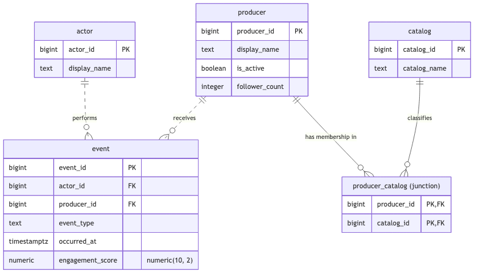

# E603 Social Media Database Project

## The domain
The theme is social media.

Todo: Add questions the platform must answer. Two to three paragraphs.

## Schema



## Query catalogue

| Unit | Query | Business question |
| --- | --- | --- |
| 3 | | |
| 4 | | |
| 5 | | |
| 6 | | |

## Technical highlights

1.
2.
3.

## What I would do differently


## Video presentation

[Video presentation]()

## How to run it

```bash
```

```sql
```

## Repository layout

| Folder / file | What goes in it |
| --- | --- |
| `README.md` | The front door. See the required sections above. |
| `/schema` | DDL script, ERD image, and constraint justifications. |
| `/queries` | One subfolder per unit (`unit3`, `unit4`, `unit5`, `unit6`), each holding that assignment's `.sql` files. |
| `/analysis` | Written notes and reflections, one markdown file per unit. |
| `/screenshots` | Execution evidence, named so each maps clearly to the task it supports, e.g. `a3-task2-null-counts.png`. |
