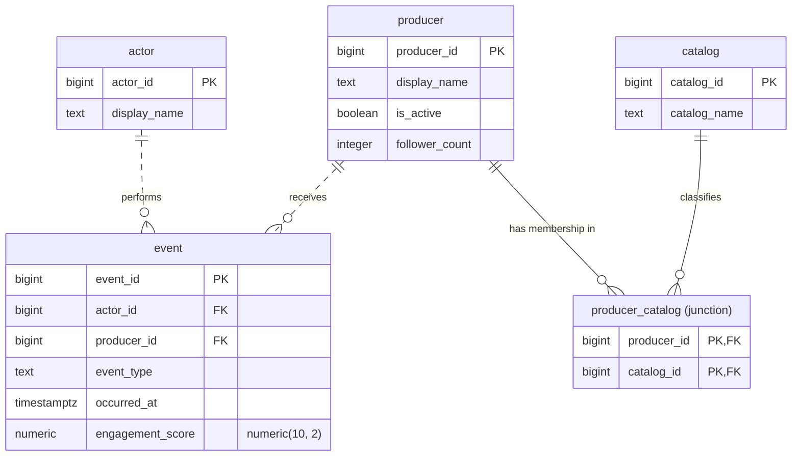

# E603 Social Media Database Project

## The domain
The theme is social media.

Todo: Add questions the platform must answer. Two to three paragraphs.

#### The five roles

| Role | What it is | Always has |
| --- | --- | --- |
| **actor** | The user who consumes or interacts with content. | A primary key and a display name. |
| **producer** | The user or account that creates content. | A primary key, a display name, an activity flag, and a numeric attribute used for filtering. |
| **event** | A recorded action in which an actor consumes or interacts with content created by a producer. | Foreign keys to actor and producer, a timestamp, and a numeric metric you will aggregate. |
| **catalog** | A category or topic used to classify content or producers. | A primary key and a name. |
| **junction** | The many-to-many link between producers and catalog categories or topics. | A composite primary key over foreign keys to producer and catalog. |

## Schema

Relation schemas: [`schema/schema-definition.md`](schema/schema-definition.md) · constraints: [`schema/constraints.md`](schema/constraints.md) · ERD: [`schema/erd.md`](schema/erd.md) · image: [`schema/erd.png`](schema/erd.png)



Cardinality: `||` exactly one · `o{` zero or more · `..` non-identifying · `--` identifying. `producer` and `catalog` are many-to-many through `producer_catalog`.

## Query catalogue

| Unit | Query | Business question |
| --- | --- | --- |
| 3 | | |
| 4 | | |
| 5 | | |
| 6 | | |

## Technical highlights

1.
2.
3.

## What I would do differently


## Video presentation

[Video presentation]()

## How to run it

```bash
```

```sql
```

## Repository layout

| Folder / file | What goes in it |
| --- | --- |
| `README.md` | The front door. See the required sections above. |
| `/schema` | Relation schemas, DDL script, ERD image, and constraint justifications. |
| `/queries` | One subfolder per unit (`unit3`, `unit4`, `unit5`, `unit6`), each holding that assignment's `.sql` files. |
| `/analysis` | Written notes and reflections, one markdown file per unit. |
| `/screenshots` | Execution evidence, named so each maps clearly to the task it supports, e.g. `a3-task2-null-counts.png`. |
