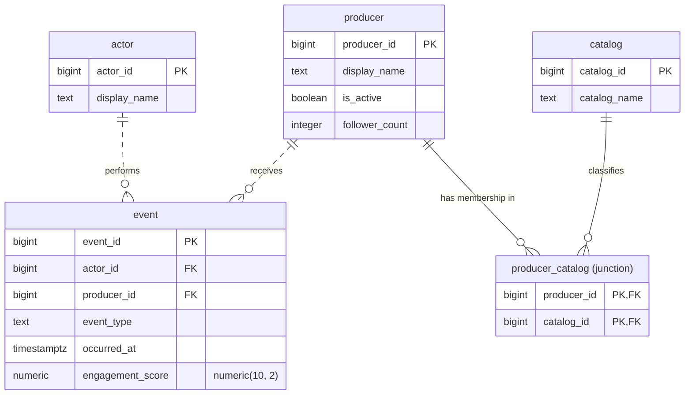

# Entity-relationship diagram

Logical schema for the five-role social media database. Crow’s-foot markers show cardinality on both sides of every relationship.

## Relationships and cardinality

| Parent | Child | Cardinality | Identifying | Meaning |
| --- | --- | --- | --- | --- |
| `actor` | `event` | one to zero-or-more (`\|\|` … `o{`) | No (`..`) | Each event is performed by exactly one actor. An actor may have no events. |
| `producer` | `event` | one to zero-or-more (`\|\|` … `o{`) | No (`..`) | Each event is about exactly one producer. A producer may have no events. |
| `producer` | `producer_catalog` | one to zero-or-more (`\|\|` … `o{`) | Yes (`--`) | Each junction row names exactly one producer. A producer may have no catalog tags. |
| `catalog` | `producer_catalog` | one to zero-or-more (`\|\|` … `o{`) | Yes (`--`) | Each junction row names exactly one catalog. A catalog may have no producers. |

`producer_catalog` is the many-to-many junction: a producer may belong to many catalogs, and a catalog may classify many producers.

## Marker key

| Token | Meaning |
| --- | --- |
| `\|\|` | exactly one |
| `o{` | zero or more |
| `..` | non-identifying (child has its own primary key) |
| `--` | identifying (foreign key is part of the child’s primary key) |
